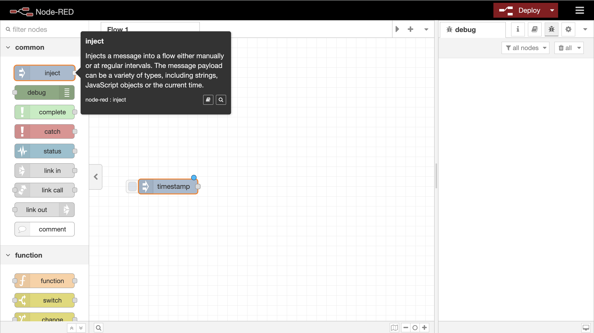
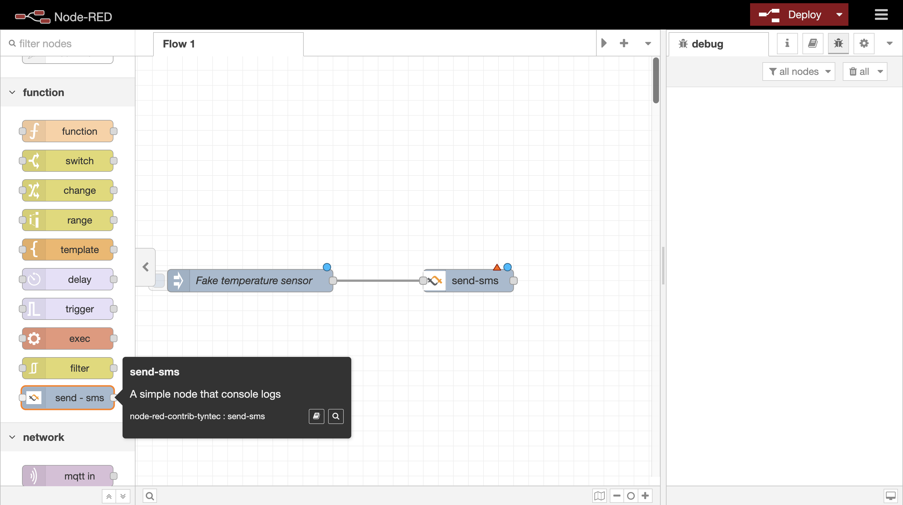
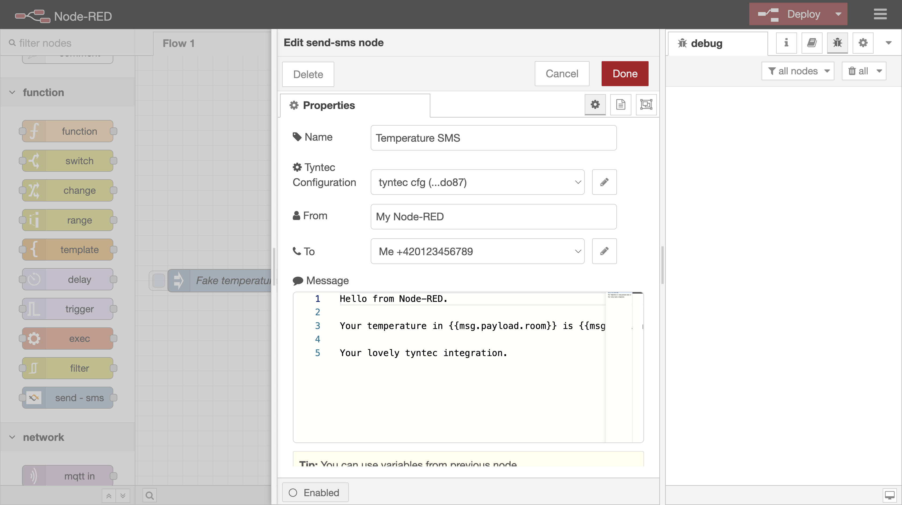
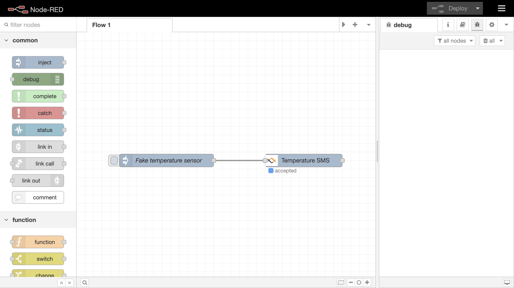

# node-red-contrib-tyntec

[Node-RED](http://nodered.org/) nodes for tyntec API.

## Features

- Send SMS

## Prerequisities

- Your own instance of [Node-RED](https://nodered.org/docs/getting-started/)
- Account for [tyntec](https://www.tyntec.com/)

## Installation

To install tyntec node to your Node-RED use this command:

```bash
  npm install node-red-contrib-tyntec
```

More detailed instructions in ["Adding nodes to the palette" in Node-RED documentation](https://nodered.org/docs/user-guide/runtime/adding-nodes).

## Usage

### Step 1: Create a new Node-RED flow

Create a new flow to add your new nodes into it.


### Step 2: Add and edit the "inject" node

Add an "inject" node.



Open the edit window of the "inject" node.


Set:

- `name` to `Fake temperature sensor`
- `msg.payload.room` to value `Livingroom`
- `msg.payload.temperature` to value `21`

Click to "Done" to save your changes.

### Step 3: Add and edit the "send-sms" node

Add a node called "send-sms" to your flow (you can find the node in a "function" section).

Connect your "Fake temperature sensor" node output to "send-sms" node input.



Edit your "send-sms" node.

Set:

- `name` to `Temperature SMS`
- add a new `Tyntec Configuration` with your tyntec API key
- (optional) `From` to your own name, which will appear as the sender's name
- add a new `To` configuration with your own name and phone number (Phone number has to be in [E.164](https://en.wikipedia.org/wiki/E.164) e.g. `+420123456789`)
- `Message` to 
  ```
  Hello from Node-RED.

  Your temperature in {{msg.payload.room}} is {{msg.payload.temperature}}ºC.

  Your lovely tyntec integration.
  ```
- (not recommended) uncheck the `Delivery check` (whether you need to confirm successful or unsuccessful SMS delivery)



### Step 4: Deploy and test your new flow

To deploy a flow, click the red "Deploy" button in the upper right corner.


Click on the square on the left side "Fake temperature sensor" to trigger the flow.

You should now see a blue dot labeled "accepted" when the SMS delivery has been triggered via the API.



If the SMS has not been delivered, the blue dot will change to red.


## Contributing