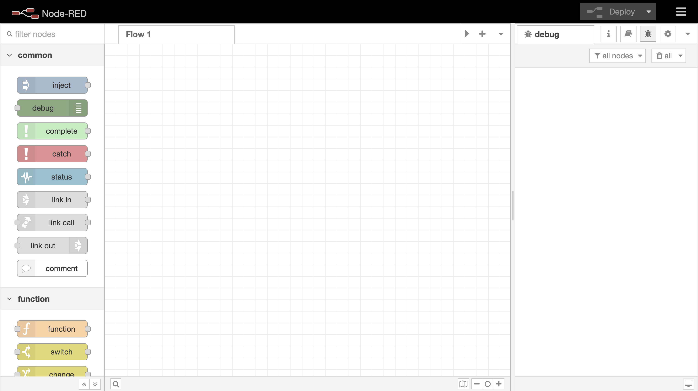
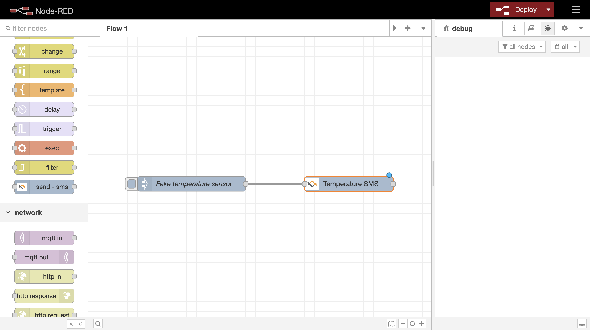

<p>
  <a href="https://tyntec.com" target="_blank"></a>
</p>

[](https://npmjs.org/package/@tyntec/node-red-contrib-tyntec)

[](https://npmjs.org/package/@tyntec/node-red-contrib-tyntec)
[](LICENSE)


---

# node-red-contrib-tyntec

We're excited to introduce a new connector for tyntec SMS services that allows you to easily incorporate SMS messaging into your Node-RED workflows. With this connector, you can **send and receive SMS messages** using tyntec's reliable and scalable REST API. You can use this integration to trigger SMS notifications, alerts, and reminders from within your Node-RED flows, and automate your SMS-based communication.
 
Our tyntec SMS services connector for Node-RED is designed to be user-friendly and flexible, so you can easily configure and customize your SMS messaging workflows. Whether you're building a chatbot, sending reminders, or triggering SMS notifications, our connector can help you seamlessly integrate SMS messaging into your Node-RED applications.

## Table of Contents

<!-- toc -->
* [Features](#Features)
* [Prerequisities](#Prerequisities)
* [Installation](#Installation)
* [Usage](#Usage)
* [Contributing](#Contributing)
* [License](#License)
<!-- tocstop -->

## Features

- Send SMS

## Prerequisities

- Your own instance of [Node-RED](https://nodered.org/docs/getting-started/)

-  [tyntec](https://www.tyntec.com/) account created

## Installation

1.  Open your Node-RED editor in a web browser and navigate to the menu on the top right corner of the screen.
    
2.  Click on the "**Manage palette**" option. This will open the Node-RED Palette Manager, which allows you to search for, install, and manage Node-RED nodes and modules.
    
3.  Click on the "**Install**" tab in the Palette Manager.
    
4.  In the "**Search**" box, type **tyntec-SMS**.
    
5.  Find the palette in the search results and click on the "**Install**" button to the right of it.
    
6.  Wait for the installation process to complete. Node-RED will download and install the palette and any necessary dependencies.
    
 Once the installation is complete, you should see the newly installed palette listed in the "Installed" tab in the Palette Manager.

>  Alternatively, you can install pallet via npm command in your project:
> 
> ```bash
> 
> npm install node-red-contrib-tyntec
> 
> ```

## Usage

### Step 1: Create a new Node-RED flow

To demonstrate the functionality of sending SMS via tyntec, we will create a fake temperature sensor. The sensor will use tyntec SMS to send its measurement data.
  
1. Create a new flow to add your new nodes into it.



2. Add an "**inject**" node.


  

3. Open the edit window of the "**inject**" node and set these values:

-  `name` to `Fake temperature sensor`
-  `msg.payload.room` to value `Livingroom`
-  `msg.payload.temperature` to value `21`
  


4. Click to "**Done**" to save your changes.

### Step 2: Add and edit the "send-sms" node

1. Add a node called "**send-sms**" to your flow (you can find the node in a "**function**" section).
2. Connect your "**Fake temperature sensor**" node output to "**send-sms**" node input.


3. Set your "**send-sms**" node. 

-  `name` to `Temperature SMS`
- add a new `Tyntec Configuration` with your tyntec API key
- (optional) `From` to your own name, which will appear as the sender's name
- add a new `To` configuration with your own name and phone number (Phone number has to be in [E.164](https://en.wikipedia.org/wiki/E.164) e.g. `+420123456789`)
-  `Message` to
```

Hello from Node-RED.

Your temperature in {{msg.payload.room}} is {{msg.payload.temperature}}ºC.

Your lovely tyntec integration.

```

> (not recommended) uncheck the `Delivery check` (whether you need to
> confirm successful or unsuccessful SMS delivery)


### Step 3: Deploy and test your new flow

1. To deploy a flow, click the red "**Deploy**" button in the upper right corner.



2. Click on the square on the left side "**Fake temperature sensor**" to trigger the flow.


3. You should now see a blue dot labeled "**accepted**" when the SMS delivery has been triggered via the API.

4. If the SMS has been delivered, the blue dot will change to green.


> If the SMS has not been delivered, the blue dot will change to red.


**And that's it! You have just integrated the tyntec SMS connector for Node-Red and used it successfully.** 

## Contributing

Feel free to contribute to our @tyntec/node-red-contrib-tyntec. Please follow the [Contribution Guide](CONTRIBUTING.md).

## License

The @tyntec/node-red-contrib-tyntec open source project is licensed under the [MIT](LICENSE).
